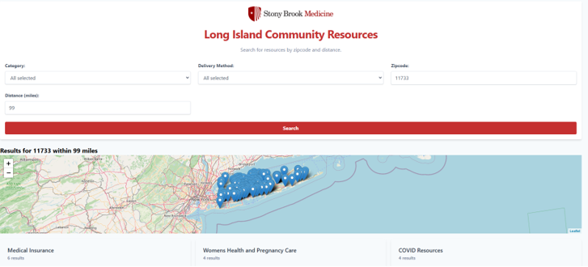

# Social Determinants of Health (SDoH) Dashboard Improvement Project

## Table of Contents
1. [Project Overview](#project-overview)
2. [Original Code Issues and Initial Work](#original-code-issues-and-initial-work)
3. [Code Updates](#code-updates)
   - [Python Script Updates](#python-script-updates)
   - [HTML & CSS Enhancements](#html--css-enhancements)
4. [Dashboard Improvements](#dashboard-improvements)
   - [First Version Changes: Enhanced Usability and Layout](#first-version-changes-enhanced-usability-and-layout)
   - [Second Version Changes: Revised Layout and Enhanced Functionality](#second-version-changes-revised-layout-and-enhanced-functionality)
   - [Usability Enhancements and Category Management](#usability-enhancements-and-category-management)
   - [Backend Enhancements](#backend-enhancements)
5. [Final Solution/Prototype](#final-solutionprototype)
6. [Test Plan and Results](#test-plan-and-results)
7. [Future Work and Recommendations](#future-work-and-recommendations)

---

## Project Overview

The **Social Determinants of Health (SDoH) Dashboard Improvement Project** was initiated in order to improve the usability, functionality, accessibility, and general performance of an existing dashboard. Initially created by a prior generation, the dashboard was intended to assist users in accessing vital community resources. However, it encountered several difficulties, including subpar UI/UX design, inaccurate data representation, and restricted response. By adhering to a disciplined methodology that gave participants defined duties and included thorough testing to provide a contemporary, user-friendly dashboard, our project solved these drawbacks.

---

## Original Code Issues and Initial Work

The dashboard's initial evaluation identified a number of problems, such as erratic user interface elements, slow response, and an ineffective filtering method. These results were recorded in a PowerPoint presentation that described the problems and suggested fixes. In order to resolve these problems and guarantee an organized approach to the redesign process, a **swimlane diagram** was made to outline the designated duties and responsibilities of each participant.

The following responsibilities were given to contributors in order to represent important areas: **Quality Assurance (QA)**, **Development (Dev)**, **User Experience (UX)**, and **Project Manager (PM)**. The project manager concentrated on establishing the project's parameters, getting input from stakeholders, and making sure accessibility guidelines were followed. A UX contributor collected user input, examined the existing user interface, and suggested design enhancements. While the QA specialist made sure the new features were accurate and functioning, the developer performed structural improvements and implemented code updates.

In order to produce a more user-friendly layout, the first changes were concentrated on **moving the map** and **repositioning elements** like the search bar and logo. The goal of these modifications was to enhance the dashboard's responsiveness and usability without making major structural alterations. Deeper feature improvements were postponed until later in the project, even though these changes fixed certain usability problems.

---

## Code Updates

### Python Script Updates

The project's second phase saw a major optimization of the backend logic. Implementing a **new category mapping system** in the `app.py` file was a significant update included in the **second version changes**. The subcategory-based filtering was replaced by this system's more expansive **general categories**, like "Food & Nutrition Services" and "Health & Medical Services." This modification enhanced the backend query structure and made filtering easier for users. Furthermore, by automating a previously manual procedure, the integration of Google Sheets and Excel workflows guaranteed that resource data remained current.

### HTML & CSS Enhancements

Throughout the project, there were numerous revisions made to the dashboard's HTML and CSS components. Relocating components like the map, search bar, and logo to make the layout cleaner was one of the initial improvements. As the project developed, the dashboard's look was updated with a comprehensive **UI redesign**. The dashboard now works flawlessly on all devices thanks to the redesign's incorporation of responsive design principles. Hover effects and error warnings are examples of intuitive visual feedback that was added to improve engagement and assist users.

---

## Dashboard Improvements

### First Version Changes: Enhanced Usability and Layout

Minor layout changes were made in the first iteration of the revamped dashboard with the goal of increasing usability. The search bar and logo were moved for improved alignment, and the map's positioning was adjusted to make it stand out more. Although the visual structure was enhanced by these modifications, the underlying functionality was mainly unaltered, and certain usability problems—like insufficient information in search results and a lack of adequate feedback mechanisms—persisted.

### Second Version Changes: Revised Layout and Enhanced Functionality

The layout and functionality were significantly enhanced in the second version. A more contemporary and clean style was introduced with the redesign of the webpage layout. A **new category mapping system** was added to the filtering system, transforming it by grouping resources under broad categories to facilitate navigation. In order to minimize visual clutter and free users to concentrate on the quality of resources rather than their quantity, category counts were also eliminated.

### Usability Enhancements and Category Management

The addition of synchronized **checkbox filters** and dropdown menus for categories were usability improvements that allowed users to more efficiently narrow down their queries. These filters ensure a consistent and user-friendly experience by updating dynamically in response to user decisions. By combining related subcategories into more general categories, the category management system, which was introduced in the second version, greatly expedited the resource filtering procedure. Both the backend query efficiency and the frontend user experience were enhanced by this modification.

### Backend Enhancements

The dashboard's performance was much improved by the backend changes. Optimized database interactions shortened query response times, and real-time resource data changes were made possible by the integration of Google Sheets and Excel workflows. The dashboard's accuracy, effectiveness, and scalability were guaranteed by these improvements.

---

## Final Solution/Prototype

Iterative changes made during the process culminated in the dashboard's final version. It has a responsive design, a contemporary user interface, and sophisticated filtering functions. Usability has been greatly improved by the addition of general categories and synchronized filters, while backend optimizations guarantee quicker performance and real-time updates. Screenshots comparing the dashboard's before and after reveal how drastically it has changed.

---

## Test Plan and Results

To verify its usability, accessibility, and functioning, the dashboard was put through thorough testing. The accuracy of features including resource presentation, map integration, and category filtering was validated by functional testing. While ADA compliance testing made sure the dashboard complied with accessibility guidelines, usability testing revealed enhancements in performance and navigation. The findings showed that on every important statistic, the updated dashboard performed better than the original.

---

## Future Work and Recommendations

Future work should concentrate on deploying **advanced analytics** to monitor user interactions and spot resource use trends in order to further improve the dashboard. By incorporating **multilingual support**, the platform would be more inclusive and able to serve a wider range of users. Additionally, creating a **mobile application** would increase user convenience and accessibility. These projects would ensure that the dashboard continues to satisfy changing user needs while building on its existing popularity.

---
